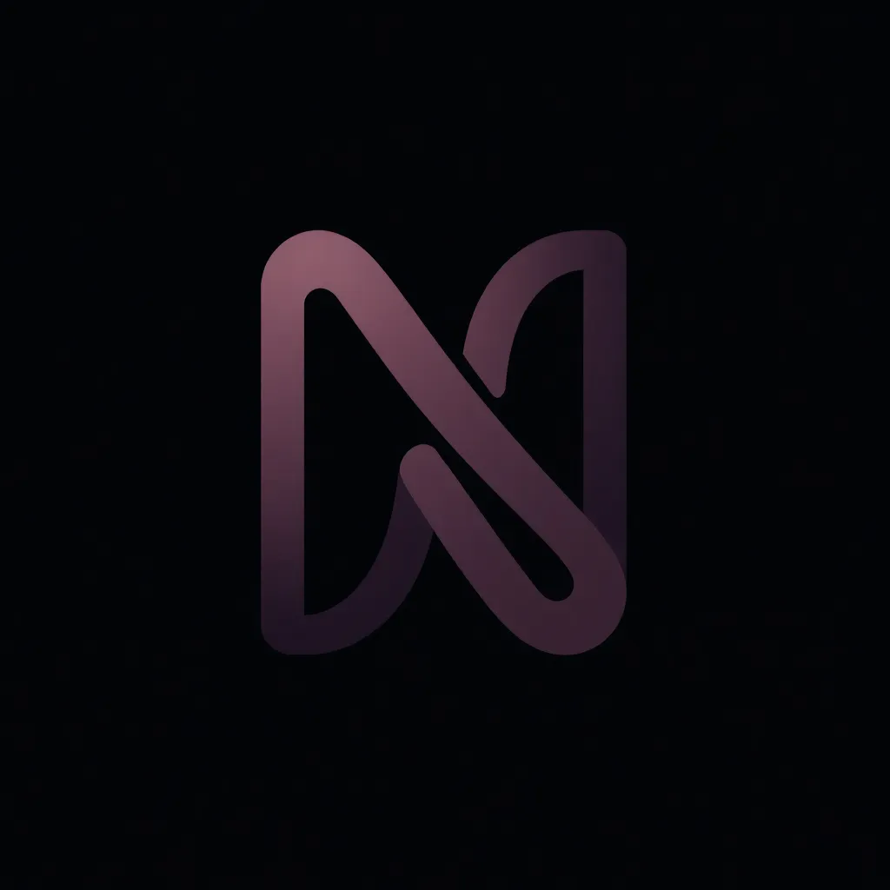

# NBF Nexus

<p align="center">
  
</p>

[](https://vercel.com/new/clone?repository-url=https%3A%2F%2Fgithub.com%2FK0lux%2Fnbf-nexus&env=NEXT_PUBLIC_CLERK_PUBLISHABLE_KEY,CLERK_SECRET_KEY,NEXT_PUBLIC_SUPABASE_URL,NEXT_PUBLIC_SUPABASE_ANON_KEY,SUPABASE_SERVICE_ROLE_KEY,OPENAI_API_KEY,DATABASE_URL)
[](https://opensource.org/licenses/MIT)

## Le Problème : Le chaos administratif des hubs de croissance
Gérer un incubateur ou une startup avec plus de 30 stagiaires et seulement 12 bureaux physiques est un défi logistique permanent. Sans outil dédié, les entreprises tombent dans le piège de la micro-gestion, de la perte d'information et de l'inefficacité opérationnelle.

## Pourquoi adopter NBF Nexus ?
NBF Nexus n'est pas un simple outil de gestion, c'est un **Système d'Exploitation pour Incubateurs**. Il résout la contrainte physique du "Flex-Office" et automatise le mentorat de premier niveau grâce à l'IA.

### Analyse Comparative : NBF Nexus vs Outils Standards

| Fonctionnalité | WhatsApp / Telegram | Email Classique | Slack / Teams | **NBF Nexus** |
| :--- | :--- | :--- | :--- | :--- |
| **Gestion des places** | Impossible (Bruit permanent) | Très lent (Allers-retours) | Manuel (Canaux dédiés) | **Automatique (Limite stricte)** |
| **Onboarding** | Perdu dans le flux | Pièces jointes oubliées | Recherche difficile | **IA Mentor 24/7 (RAG)** |
| **Pointage** | Déclaratif (Peu fiable) | Inexistant | Check-in manuel | **QR Code Dynamique & GPS** |
| **Workflows** | Flous (Post-its digitaux) | Silos isolés | Fils de discussion | **Tableau de bord centralisé** |
| **Coût** | Gratuit | Inclus | Payant (Standard) | **Gratuit (Open Source)** |

### Les 3 Piliers de l'Adoption
1. **Élimination de la micro-gestion** : L'administration ne passe plus son temps à valider des présences ou à répondre aux mêmes questions sur le rapport de stage.
2. **Preuve de présence infalsifiable** : Le système de QR Code dynamique garantit que le stagiaire est physiquement présent au hub.
3. **Passage à l'échelle (Scale)** : NBF Nexus permet de gérer 100 stagiaires avec la même équipe administrative qu'auparavant.

---

## Architecture : Feature-Sliced Design (FSD)
Le projet est structuré selon la méthodologie FSD pour garantir une maintenance et une évolution propres :
- [Architecture Guide](nbf-nexus/docs/ARCHITECTURE.md)
- [Testing Strategy](nbf-nexus/docs/TESTING.md)
- [Contributing Guide](nbf-nexus/docs/CONTRIBUTING.md)
- [User Guide](nbf-nexus/docs/USER_GUIDE.md)

---

## Installation Rapide

1. **Cloner le dépôt**
   ```bash
   git clone https://github.com/K0lux/nbf-nexus.git
   cd nbf-nexus
   ```

2. **Installation**
   ```bash
   npm install
   ```

3. **Lancement**
   ```bash
   npm run dev
   ```

---

## Licence
Distribué sous la licence **MIT**. Voir `LICENSE` pour plus d'informations.

**Développé par [K0lux](https://github.com/K0lux) chez New Brain Factory.**
